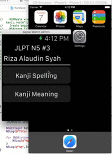

## KanjiQuiz
This is a fully functioned iOS8 apple watch application with Kii integration.
Mainly coded on swift.
### Quiz on iPhone 6

### Quiz on Apple Watch simulator

### Kanji Source
Source: ©  — property of the Electronic Dictionary Research and Development Group, used in conformance with the Group's . Support the WWWJDIC project by . 
